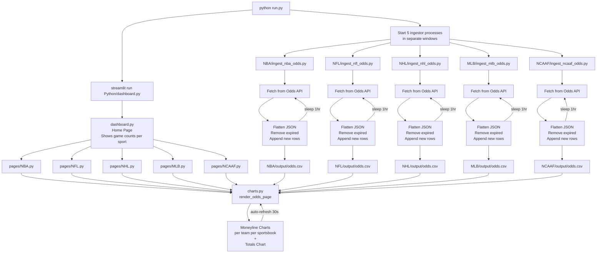

```mermaid
flowchart TD
    A[python run.py] --> B[Start 5 ingestor processes\nin separate windows]
    A --> C[streamlit run Python/dashboard.py]

    B --> NBA[NBA/ingest_nba_odds.py]
    B --> NFL[NFL/ingest_nfl_odds.py]
    B --> NHL[NHL/ingest_nhl_odds.py]
    B --> MLB[MLB/ingest_mlb_odds.py]
    B --> NCAAF[NCAAF/ingest_ncaaf_odds.py]

    NBA --> API1[Fetch from Odds API]
    NFL --> API2[Fetch from Odds API]
    NHL --> API3[Fetch from Odds API]
    MLB --> API4[Fetch from Odds API]
    NCAAF --> API5[Fetch from Odds API]

    API1 --> W1[Flatten JSON\nRemove expired\nAppend new rows] --> O1[NBA/output/odds.csv]
    API2 --> W2[Flatten JSON\nRemove expired\nAppend new rows] --> O2[NFL/output/odds.csv]
    API3 --> W3[Flatten JSON\nRemove expired\nAppend new rows] --> O3[NHL/output/odds.csv]
    API4 --> W4[Flatten JSON\nRemove expired\nAppend new rows] --> O4[MLB/output/odds.csv]
    API5 --> W5[Flatten JSON\nRemove expired\nAppend new rows] --> O5[NCAAF/output/odds.csv]

    W1 -->|sleep 1hr| API1
    W2 -->|sleep 1hr| API2
    W3 -->|sleep 1hr| API3
    W4 -->|sleep 1hr| API4
    W5 -->|sleep 1hr| API5

    C --> HOME[dashboard.py\nHome Page\nShows game counts per sport]
    HOME --> P1[pages/NBA.py]
    HOME --> P2[pages/NFL.py]
    HOME --> P3[pages/NHL.py]
    HOME --> P4[pages/MLB.py]
    HOME --> P5[pages/NCAAF.py]

    P1 & P2 & P3 & P4 & P5 --> CH[charts.py\nrender_odds_page]

    O1 --> CH
    O2 --> CH
    O3 --> CH
    O4 --> CH
    O5 --> CH

    CH --> VIZ[Moneyline Charts\nper team per sportsbook\n+\nTotals Chart]
    VIZ -->|auto-refresh 30s| CH
```
